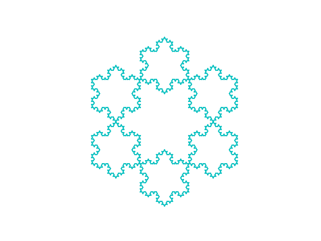
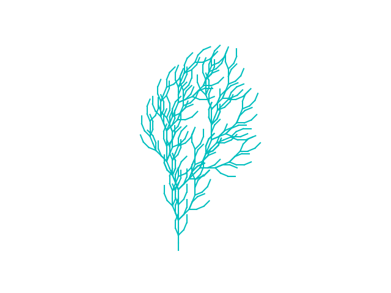

# Lindenmayer systems

This is an L-system recursive python implementation. [L systems](https://en.wikipedia.org/wiki/L-system) are replacing subterms systems that are known for their versatile use for generating fractals. Such fractals may be biological or matheimatical.

